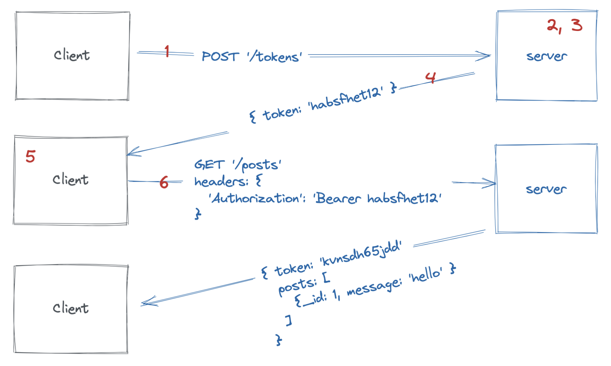

# Mobile Acebook Backend

This repository contains a backend application using the ME~~R~~N stack. The
frontend code has been removed.

:warning: You won't make any changes to this respository. You'll be focusing on integrating your Mobile App with
the existing backend within this repository.

The application is the same you just worked on during your recent [Engineering
Project](https://journey.makers.tech/modules/engineering-project-2),
so it should be extremely familiar.

:information_source: Do not worry if you used a different tech stack for your
Acebook project (e.g. Ruby on Rails), as the project is designed to be
backend-agnostic really. Keep reading and this will make more sense soon!

In order to figure out how to use this back-end, refer to the *Mobile_Acebook_Backend.postman_collection.json* file in the utils folder - **all the details for the endpoints are contained there**, so that you can **structure your requests to this back-end from your mobile application**. You can **import this collection to your own postman workspace** in order to test the endpoints and figure out how to write the requests. 

**You will have to replace some of the data in the Authorization tab and in some of the urls to make the most of the collection**. Wherever EXISTING_USERID or EXISTING_POST_ID is specified, you need to provide a relevant id from your own database for these endpoints to work as intended, or you'll encounter some errors. 


## Existing Features

This is a complete Acebook project, but you will only integrate your Mobile App
against a subset of the features already available.

Feel free to explore more features if you have extra time!

:information_source: However, please note that you do not own the backend as
it's managed by another team.

Any requests for additional endpoints or changes will be analyzed by this team
and taken into consideration. However you can make your requests (via your
coach!).


## API Endpoints Overview

Here's a quick overview of the API endpoints you'll be interacting with:

| Endpoint                    | Method | Payload Model | Description                          | Response Values                          |
|-----------------------------|--------|---------------|--------------------------------------|------------------------------------------|
| http://localhost:3000/users  | POST   | User          | Sign up a new user                   | 201 OK: `{ message: 'OK' }`              |
| http://localhost:3000/tokens | POST   | email, password | Log in an existing user            | 201 OK: `{ token: String, message: 'OK' }`|
| http://localhost:3000/posts  | POST   | NewPost       | Create a new post                    | 201 OK: `{ message: 'OK', token: String }`|
| http://localhost:3000/posts  | GET    | N/A           | Fetch all posts                      | 200 OK: `{ posts: [Post], token: String }` |


Remember to include the token in the request headers for authenticated routes.


## Postman collections

We have created a Postman collection with all the relevant requests in it for
the week, in case you need to test your backend in isolation to get clarity
about payloads, etc.

This collection should help you make sense of what the Models in the table above
mean :)

Consider this a hint for your SwiftUI mobile app!

You can find it [here](./api/utils/Mobile_Acebook_Backend.postman_collection.json).

And to import it in Postman, simply click on "File" -> "Import" and select the
above file, a new collection should be created and you're ready to go!


<br>

-------
-------
-------

<br>


We have also included all the relevant instructions that were part of the
[original template for the MERN Acebook
project](https://github.com/makersacademy/acebook-mern-vite) just below as
well for reference in case you need them.

## Technologies

### **M** is for MongoDB
[MongoDB](https://www.mongodb.com/) is a _NoSQL_ database program that stores
data in collections of documents (in a format similar to JSON), rather than in
tables. The application interacts with MongoDB using a tool called Mongoose.

### **E** is for Express
[Express](https://expressjs.com/) is the Javascript equivalent of Sinatra. The
structure of this application will feel quite different to what you're used to
but the principles are the same.

### **N** is for Node
Javascript was originally designed to run exclusively in browsers, such as
Chrome. [Node](https://nodejs.org/en/) is a tool that allows you to run
Javascript outside the browser and its invention made it possible to build full
stack Javascript apps.


## Architecture

This application is comprised of a backend API built with Express. You can find more details about this backend's architecture [here](https://github.com/makersacademy/acebook-mern-vite/blob/main/docs/backend_structure.md)

## Authentication

Here's the authentication flow for this application

1. A registered user submits their email address, username and password from the frontend
   (our Mobile App in this case).
2. The backend receives the data and tries to find a user in the DB with the
   same email address.
3. If a user is found, the password in the database is compared to the password
   that was submitted.
4. If the passwords match, a JSON Web Token is generated and returned, as part
   of the response.
5. The frontend receives the token and holds on to it.
6. Every request to the backend that requires authentication must include a
   valid token (which is checked by the backend).
7. When the user logs out, the front end discards the token.



### What is a JSON Web Token?

A JSON Web Token, or JWT, is a token that comprises three parts

- A header, which contains information about how the token was generated.
- A signature, which is used to verify the token.
- A payload, which you can use to store some **non-sensitive data** like a user
  id. Note that the payload is not secure and can be decoded very easily.

The signature is created using a 'secret', which must be kept private (i.e. not
put on GitHub) otherwise nefarious internet users could start to issue tokens
for your application.

Here, we've used an environment variable called `JWT_SECRET`, which you'll set up (see below). You can
change the value of that environment variable to anything you like.


## Quickstart

### Set up your project

1. Have one team member fork this repository
2. Rename the fork to `acebook-<team name>`
3. Every team member clone the fork to their local machine
4. Install dependencies:
   ```
   cd ../api
   npm install
   ```
5. Install MongoDB (ONLY IF YOU HAVEN'T ALREADY - skips this step if so, to avoid running into issues)
   ```
   brew tap mongodb/brew
   brew install mongodb-community@6.0
   ```
   *Note:* If you see a message that says `If you need to have
   mongodb-community@5.0 first in your PATH, run:`, follow the instruction.
   Restart your terminal after this.
6. Start MongoDB
   ```
   brew services start mongodb-community@6.0
   ```
   
### Setting up environment variables.

We need to create a `.env` file to contain our sensitive environment information. 

Create a file `api/.env` with the following contents:

```
MONGODB_URL="mongodb://0.0.0.0/acebook"
NODE_ENV="development"
JWT_SECRET="secret"
```

### Start

:warning: Make sure that your backend server (in `./api`) is running so that you
can interact with it from your Mobile App.

1. Start the server application (in the `api` directory) in dev mode:

```
; cd api
; npm run dev
```

## MongoDB Connection Errors?

Some people occasionally experience MongoDB connection errors when running the
tests or trying to use the application. Here are some tips which might help
resolve such issues.

- Check that MongoDB is installed using `mongo --version`
- Check that it's running using `brew services list`

If you have issues that are not resolved by these tips, please reach out to a
coach and, once the issue is resolved, we can add a new tip!
